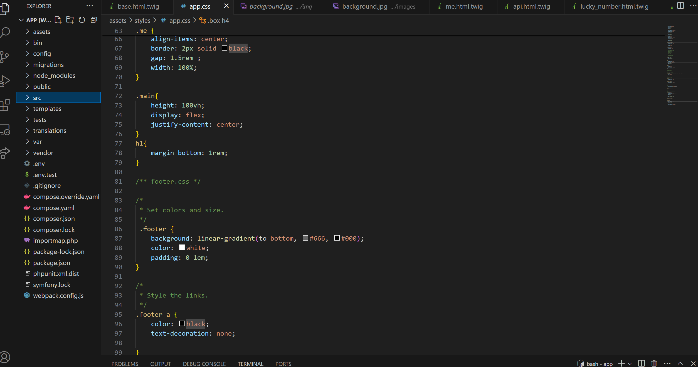

# Min MVC-webbapplikation



## Beskrivning

Detta är en webbapplikation utvecklad med MVC (Model-View-Controller) arkitektur. MVC är ett designmönster som hjälper till att strukturera koden på ett sätt som separerar logik och presentation.

## MVC-arkitektur

MVC-arkitekturen består av tre huvudkomponenter:

### 1. Model (Modell)

Modellen representerar applikationens data och affärslogik. Den hanterar dataåtkomst, bearbetning av data och affärsregler. Modellen är oberoende av användargränssnittet och kommunicerar vanligtvis med databasen för att hämta och spara data.

### 2. View (Vy)

Vyn är ansvarig för att visa data för användaren. Den tar emot data från modellen och formaterar det för att visas på användargränssnittet. Vyn är passiv och reagerar på användarinteraktioner genom att skicka begäranden till kontrollern.

### 3. Controller (Kontroller)

Kontrollern fungerar som en mellanhand mellan modellen och vyn. Den tar emot användarinteraktioner från vyn, behandlar dem genom att hämta och bearbeta data från modellen och skickar sedan det resultatet tillbaka till vyn för att visas för användaren. Kontrollern styr flödet av applikationen och hanterar användarens begäranden.

## Kom igång

För att köra webbapplikationen lokalt på din dator, följ dessa steg:

1. Klona detta repository till din lokala maskin med följande kommando:

   ```bash
   git clone git@github.com:Abedsandid1997/MVC.git