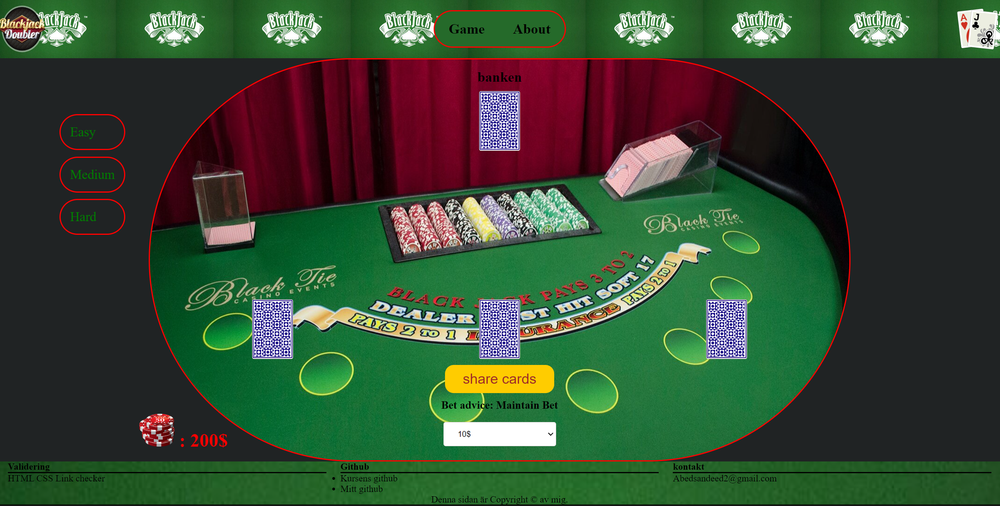

# Min MVC-webbapplikation

## Beskrivning

Detta är en webbapplikation utvecklad med MVC (Model-View-Controller) arkitektur. MVC är ett designmönster som hjälper till att strukturera koden på ett sätt som separerar logik och presentation.

## MVC-arkitektur

MVC-arkitekturen består av tre huvudkomponenter:

### 1. Assets

Innehåll: Statisk tillgångar som CSS, JavaScript, och bilder.
Syfte: Förbättra användargränssnittet och användarupplevelsen.

### 2. Bin

Innehåll: Skript och binära filer för att hantera projektet.
Syfte: Hjälpa med projektets konfiguration och hantering.

### 3. Config

Innehåll: Konfigurationsfiler för projektet.
Syfte: Styra inställningar för olika delar av applikationen.

### 4. Docs

Innehåll: Dokumentation för projektet.
Syfte: Ge användare och utvecklare information om hur projektet fungerar och hur det ska användas.

### 5. Migrations

Innehåll: Databas-migrationsfiler.
Syfte: Hantera ändringar i databasens schema över tid.

### 6. Public

Innehåll: Offentligt tillgängliga filer som index.php.
Syfte: Fungera som ingångspunkt för webbapplikationen.

### 7. Src

Innehåll: Huvudkällkoden för projektet, inklusive klasser och funktioner för BlackJack-spelet.
Syfte: Implementera den primära funktionaliteten i projektet.

### 8. Templates

Innehåll: Twig-mallar för rendering av HTML-sidor.
Syfte: Styra utseendet och layouten av webbapplikationens sidor.

### 9. Tests

Innehåll: Testfall och enhetstester.
Syfte: Säkerställa att koden fungerar som förväntat och upprätthålla kvalitet.

### 10. Translations

Innehåll: Översättningsfiler.
Syfte: Stödja flerspråkighet i applikationen.

## Viktiga filer

### .env och .env.test

Syfte: Hålla miljövariabler och konfigurationsinställningar för olika miljöer (utveckling, testning).

### .gitignore

Syfte: Specificera filer och kataloger som ska ignoreras av Git.

### compose.override.yaml och compose.yaml

Syfte: Docker-compose-filer för att hantera containerkonfigurationer.

### composer.json och composer.lock

Syfte: Hantera PHP-dependencies och paket.

### phpunit.xml.dist

Syfte: Konfigurationsfil för PHPUnit-testning.

### webpack.config.js

Syfte: Konfigurationsfil för Webpack, som används för att paketera frontend-tillgångar.

## Syfte med projektet
Projektet finns för att skapa en simuleringsmiljö för ett BlackJack-spel där olika strategier och beslut kan implementeras och testas. Det ger en grund för att:

### Utveckla och testa spelstrategier:

Genom olika nivåer av bankens "intelligens" kan man studera och förstå hur olika taktiker påverkar spelets resultat.

### Utveckla webbapplikation:

Med användning av Symfony och andra webbutvecklingsverktyg, kan projektet utvidgas till en fullständig webbapplikation.

### Lära sig programmering och bästa praxis

Projektet fungerar som ett utmärkt exempel för att lära sig moderna utvecklingsmetoder, inklusive testdriven utveckling (TDD), kontinuerlig integration (CI), och containerisering med Docker.

### Genom att inkludera all nödvändig funktionalitet från backend-logik till frontend-gränssnitt och testning, erbjuder projektet en komplett miljö för att utforska och utveckla ett BlackJack-spel.

## Kom igång

För att köra webbapplikationen lokalt på din dator, följ dessa steg:

1. Klona repot. git clone https://github.com/Abedsandid1997/MVC
2. Installera PHP- och JavaScript-dependencies.
3. Konfigurera miljövariabler.
4. Starta utvecklingsservern.
5. (Valfritt) Använd Docker för containerisering.
6. Kör tester för att verifiera installationen.

   
## Scrutinizer badges:

